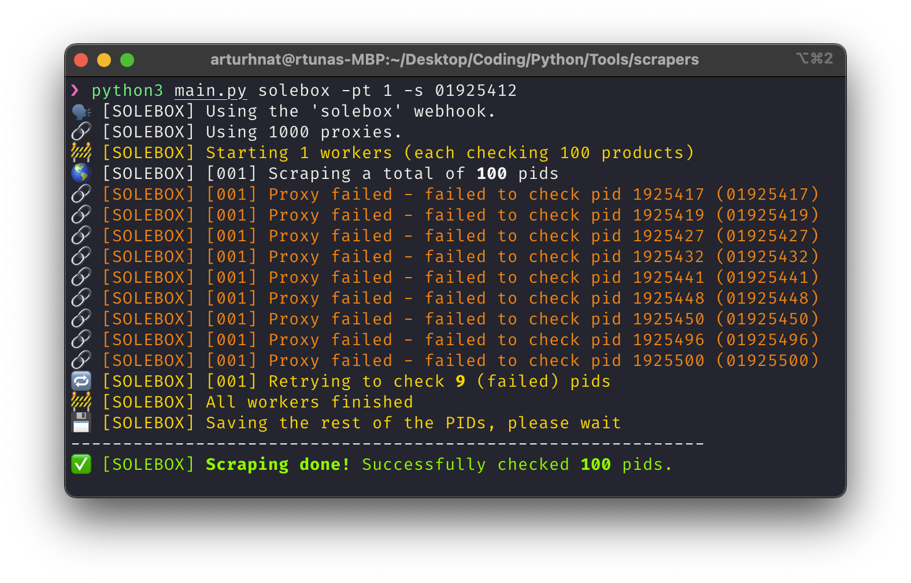

<p align="center"></p>

# sCraper
A collection of product scrapers for various websites.

### Supported sites
 - Footpatrol
 - Size
 - JDSports EU
 - TheHipStore
 - Solebox
 - Snipes
 - Onygo
> Support for more websites yet to come.


### Usage

#### Command
> Make sure to [install](#Installation) and [configure](#Configuration) the command before running.

```sh
# Show the usage info
craper -h

# Start a Footpatrol scraper
craper footpatrol

# Start 10 Footpatrol scrapers, each scraping 100 product IDs
craper footpatrol -t10 -n100

# Start one scraper with proxies, starting from pid 01925412
craper solebox -pt 1 -s 01925412
```

#### Python script
You may also run the scraper as a Python script. Syntax is exactly the same as for the `craper` command, you just replace `craper` with `python3 main.py`.



### Installation
After cloning this repository, run:
```sh
python3 -m pip install -r requirements.txt
```

### Configuration


## Todo
- [x] Finish readme
- [x] Add terminal colors
- [x] Support commandline arguments
- [ ] Tests
- [ ] ? Script for adding additional sites
